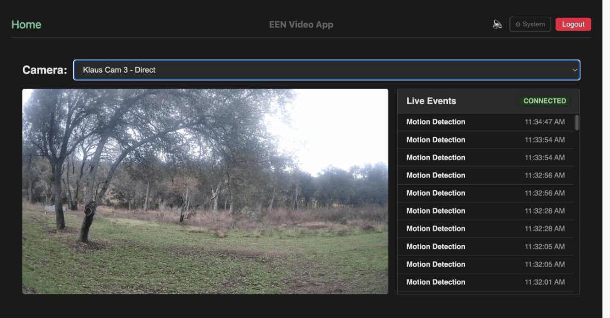

# BRIVO Video

A Vue 3 web application for viewing live HD camera video and real-time events from the Eagle Eye Networks (EEN) Video Platform, built with the [een-api-toolkit](https://github.com/klaushofrichter/een-api-toolkit) using the [een-oauth-proxy](https://github.com/klaushofrichter/een-oauth-proxy).



## Features

- **OAuth Authentication** -- Login via Eagle Eye Networks identity provider with token persistence across page refreshes
- **Camera Selection** -- Dropdown to browse and select from all cameras in your EEN account, with selection persisted to localStorage
- **Live HD Video** -- Full-resolution live video streaming using the EEN Live Video Web SDK
- **Real-Time Event Feed** -- SSE (Server-Sent Events) subscription showing live events (motion detection, person detection, etc.) for the selected camera
- **Event Type Filter** -- Multi-select dropdown to filter which event types are subscribed, with select all/unselect all toggle and selection persisted to localStorage
- **Event Preview Images** -- Click any event to view a recorded preview image from that timestamp in a modal, with bounding box overlays for detection events
- **Live Bounding Boxes** -- Real-time bounding boxes flash on the live video when detection events arrive within 5 seconds
- **Audio Notifications** -- Audible beep on each incoming event, with mute/unmute toggle
- **Dark Mode** -- Three-way theme toggle (system / light / dark) persisted to localStorage
- **Responsive Layout** -- Video and event list side-by-side on desktop, stacked on mobile
- **E2E Tests** -- Playwright tests against the live EEN service covering login, camera selection, video playback, and logout

## Prerequisites

- Node.js 20+
- An Eagle Eye Networks account with at least one camera
- An OAuth proxy (e.g. Cloudflare Worker) configured for your EEN client ID

## Setup

```bash
npm install
cp .env.example .env
# Edit .env with your EEN credentials
```

## Development

```bash
npm run dev
# Open http://127.0.0.1:3333
```

## Build

```bash
npm run build
```

## E2E Tests

Requires `TEST_USER` and `TEST_PASSWORD` in `.env` for a valid EEN account.

```bash
npm run test:e2e          # headless
npm run test:e2e:headed   # with visible browser
```

## Tech Stack

- Vue 3 + TypeScript + Vite
- Pinia (state management)
- Vue Router
- [een-api-toolkit](https://github.com/klaushofrichter/een-api-toolkit) (EEN API integration)
- [@een/live-video-web-sdk](https://www.npmjs.com/package/@een/live-video-web-sdk) (HD video streaming)
- Playwright (E2E testing)
